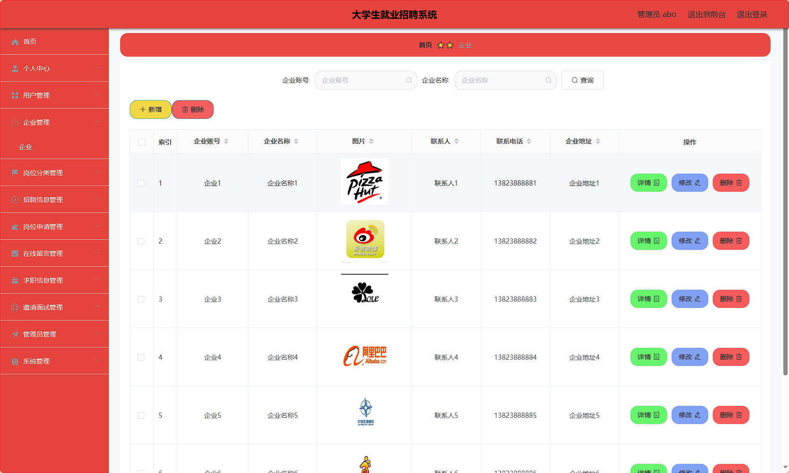

# SpringBoot-Vue-001_College-Employment-Recruitment-System

基于 SpringBoot + MyBatis Plus + Shiro 的 B/S 架构招聘平台，包含管理员、企业用户、求职者三类角色，实现岗位发布、简历投递、在线留言等功能。采用 MySQL 数据库存储，前端集成 LayUI 组件库，支持文件上传和百度 AI 接口集成。

# 大学生就业招聘系统 / College Employment Recruitment System


# 项目简介  
基于 SpringBoot + MyBatis Plus + Shiro 的 B/S 架构招聘平台，包含管理员、企业用户、求职者三类角色，实现岗位发布、简历投递、在线留言等功能。采用 MySQL 数据库存储，前端集成 LayUI 组件库，支持文件上传和百度 AI 接口集成。

# 特征介绍  
- ​​**​权限体系​**​：Shiro 实现动态权限控制，支持管理员/企业/用户三级权限分离  
- ​​**​高效持久层​**​：MyBatis Plus 自动生成基础 CRUD 操作，XML 映射文件独立管理  
- ​​**​文件管理​**​：集成 Commons-IO 实现简历上传下载，独立文件控制器处理资源请求  
- ​​**​接口安全​**​：自定义登录拦截器（AuthorizationInterceptor）保障 API 访问安全  
- ​​**​智能扩展​**​：集成百度 AI Java SDK 为后续智能推荐预留接口  
- ​​**​多端适配​**​：分离 admin/front 目录实现管理端与用户端界面独立开发  

# 代码结构 
```
src/
├── main/
│   ├── java/
│   │   ├── com/
│   │   │   ├── annotation/          # 安全注解
│   │   │   │   ├── IgnoreAuth.java
│   │   │   │   ├── LoginUser.java  
│   │   │   ├── config/              # 全局配置
│   │   │   │   ├── InterceptorConfig.java
│   │   │   │   ├── MybatisPlusConfig.java  
│   │   │   ├── controller/          # 接口层
│   │   │   │   ├── GangweifenleiController.java
│   │   │   │   ├── GangweishenqingController.java
│   │   │   ├── dao/                 # 数据访问层
│   │   │   │   ├── GangweifenleiDao.java
│   │   │   │   ├── QiuzhixinxiDao.java
│   │   │   ├── entity/              # 数据模型
│   │   │   │   ├── GangweifenleiEntity.java
│   │   │   │   ├── model/           # 业务模型
│   │   │   │   ├── view/            # 视图模型
│   │   │   ├── interceptor/         # 请求拦截器
│   │   │   │   ├── AuthorizationInterceptor.java
│   │   │   ├── service/             # 服务层
│   │   │   │   ├── impl/            # 服务实现
│   │   │   │   │   ├── GangweifenleiServiceImpl.java
│   │   │   ├── utils/               # 工具类
│   │   │   │   ├── BaiduUtil.java
│   │   │   │   ├── FileUtil.java
│   ├── resources/
│   │   ├── mapper/                  # MyBatis映射文件
│   │   │   ├── GangweifenleiDao.xml
│   │   ├── application.yml          # 主配置
│   │   ├── admin/                   # 管理端前端
│   │   │   ├── src/
│   │   │   │   ├── views/           # 业务页面
│   │   │   │   ├── router/          # 路由配置
│   │   ├── front/                   # 用户端前端
│   │   │   ├── pages/               # 静态页面
│   │   │   ├── layui/               # UI框架
```
# 使用说明
```
后台地址：http://localhost:8080/springbootiv1oo/admin/dist/index.html  
管理员账号：abo / abo  

前台地址：http://localhost:8080/springbootiv1oo/front/index.html  

数据库配置（application.yml）：
  url: jdbc:mysql://localhost:3306/springbootiv1oo
  username: root
  password: 123456

推荐运行环境：Google Chrome 浏览器
```

# 项目实际截图：
## 登录：


## 前台：


## 后台：




> 等等...

# 精选项目导航 & 快速部署工具
## 项目资源一站直达
- ​**访问项目导航站**：[点击进入](http://sysadmin.3vfree.vip)**快速检索所需项目名称**
- ​**技术栈全覆盖**：Java/SSm/Spring Boot/小程序等主流技术方案
- ​**配套资源**：每个项目均提供部署文档 + 演示视频（附效果截图）

### ▌导航站预览


### ▌工具界面预览


# 捐赠
> 博主将持续更新Java全栈开发项目，包含ssm，springboot，前后端分离系统等项目。
> 此外如果您够宽裕，请博主喝杯咖啡吧！捐赠将用于服务器维护与开源社区建设，感谢您的认可！
> 如需更多Java相关项目毕设3000+，有其他项目需求，sql文件等可联系博主v:xq-lucky311

---
